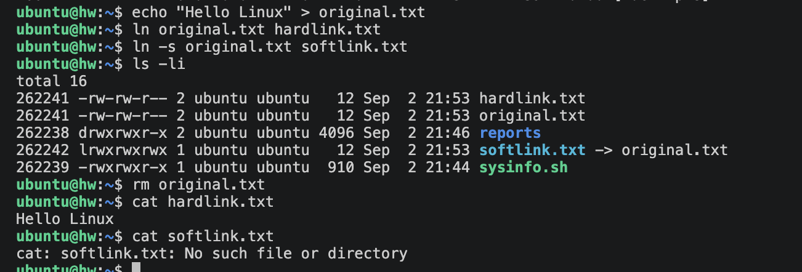
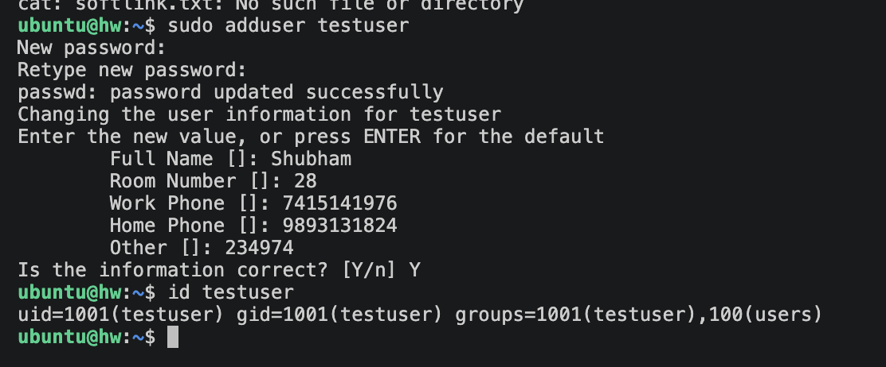
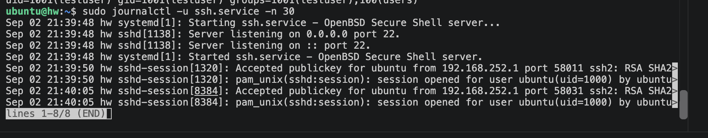
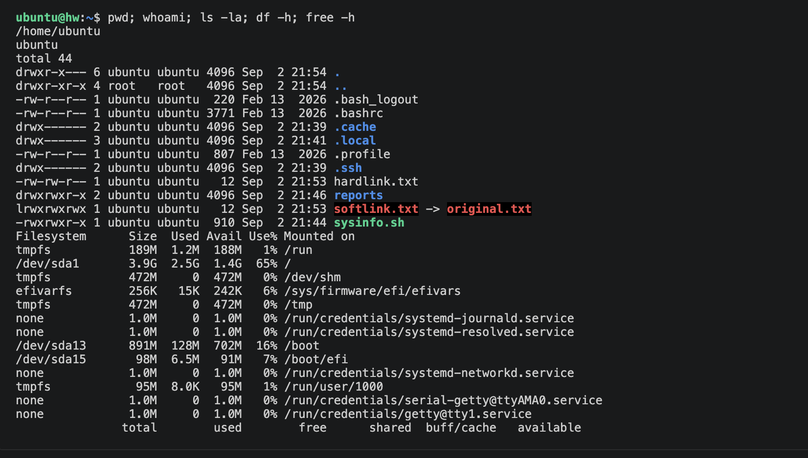

# Linux Fundamentals - Homework

My notes and practice for four Linux tasks: links, user creation, journalctl, and a command cheat sheet.

## Task 1: Soft Link and Hard Link

### Hard Link
- Points directly to the inode (the actual data on disk), not to a filename.
- The data is deleted only when all hard links to it are removed.
- Cannot cross different filesystems/partitions.
- Cannot link to a directory.
- Shares the same inode number as the original file.

### Soft Link (Symbolic Link)
- Points to the pathname of another file, like a shortcut.
- If the original file is deleted, the symlink breaks (dangling link).
- Can cross filesystems/partitions.
- Can link to a directory.
- Has its own inode. In `ls -l` it shows as `link -> target`.

### Difference

| Feature | Hard Link | Soft Link |
|---|---|---|
| Points to | Inode (data) | Pathname (filename) |
| Cross filesystem | No | Yes |
| Link to directory | No | Yes |
| If original deleted | Data still accessible | Link breaks |
| Inode number | Same as original | Different |

### Commands
Create a hard link:
```bash
ln original.txt hardlink.txt
```

Create a soft link:
```bash
ln -s original.txt softlink.txt
```

Delete a link:
```bash
rm hardlink.txt
unlink softlink.txt
```

### Practice
```bash
echo "Hello Linux" > original.txt

ln    original.txt hardlink.txt
ln -s original.txt softlink.txt

ls -li          # compare inode numbers and link counts

rm original.txt
cat hardlink.txt     # still prints "Hello Linux"
cat softlink.txt     # No such file or directory
```

### Screenshot



## Task 2: adduser vs useradd

### Difference

| | useradd | adduser |
|---|---|---|
| Type | Low-level binary | High-level script (wraps useradd) |
| Interactive | No, needs flags | Yes, prompts for details |
| Home directory | Only with `-m` | Created automatically |
| Password | Set separately with passwd | Prompts during creation |
| Default shell | Often /bin/sh | Sets /bin/bash |

### Which is preferred on Ubuntu and why
`adduser` is preferred on Ubuntu/Debian because it does the full job in one step: creates the home directory, copies skeleton files from `/etc/skel`, sets a default shell, and prompts for the password and user details. `useradd` is the lower-level tool that `adduser` uses underneath, which is better for scripting.

### Create a test user
```bash
sudo adduser testuser
```

Verify:
```bash
id testuser
grep testuser /etc/passwd
ls -la /home/testuser
```

Delete when done:
```bash
sudo deluser --remove-home testuser
```

### Screenshot



## Task 3: journalctl

`journalctl` is used to view logs collected by systemd's journal (systemd-journald). It is the central place to read boot logs, kernel messages, and service logs on systemd-based systems.

### Usage
View all logs:
```bash
journalctl
```

Jump to the end / follow live:
```bash
journalctl -e
journalctl -f
```

Logs for a specific service:
```bash
journalctl -u ssh.service
```

Logs since last boot:
```bash
journalctl -b
```

Filter by time:
```bash
journalctl --since "1 hour ago"
journalctl --since today
```

Only errors:
```bash
journalctl -p err
```

Last 50 lines:
```bash
journalctl -n 50
```

### Practice: logs for a specific service
```bash
sudo journalctl -u ssh.service -e
```

### Screenshot



## Task 4: Linux Command Cheat Sheet

### Files and Directories
| Command | Purpose |
|---|---|
| `pwd` | Print current directory |
| `ls -la` | List all files with details |
| `cd /path` | Change directory |
| `mkdir dir` | Create a directory |
| `rm file` | Remove a file (`-r` recursive) |
| `cp src dst` | Copy files |
| `mv src dst` | Move or rename files |
| `touch file` | Create empty file |
| `find /path -name "*.txt"` | Search for files |

### Viewing and Editing
| Command | Purpose |
|---|---|
| `cat file` | Print a file |
| `less file` | Scroll through a file |
| `head -n 20 file` | First 20 lines |
| `tail -n 20 file` | Last 20 lines (`-f` to follow) |
| `nano` / `vim` | Text editors |
| `grep "pattern" file` | Search inside files |

### Permissions
| Command | Purpose |
|---|---|
| `chmod 755 file` | Change permissions |
| `chown user:group file` | Change owner |
| `ls -l` | View permissions |

### Users
| Command | Purpose |
|---|---|
| `whoami` | Current username |
| `id` | User and group IDs |
| `sudo adduser name` | Add a user |
| `passwd` | Change a password |
| `su - user` | Switch user |

### Processes and System
| Command | Purpose |
|---|---|
| `ps aux` | List running processes |
| `top` | Live process monitor |
| `kill PID` | Terminate a process |
| `df -h` | Disk usage |
| `free -h` | Memory usage |
| `uname -a` | System info |

### Networking
| Command | Purpose |
|---|---|
| `ping host` | Test connectivity |
| `curl url` / `wget url` | Fetch / download |
| `ip a` | Show network interfaces |
| `ss -tulpn` | Listening ports |

### Services
| Command | Purpose |
|---|---|
| `systemctl status svc` | Service status |
| `systemctl restart svc` | Restart a service |
| `journalctl -u svc` | View service logs |

### Extras
| Command | Purpose |
|---|---|
| `man command` | Manual page |
| `history` | Command history |
| `tar -czvf a.tar.gz dir` | Create archive |
| `tar -xzvf a.tar.gz` | Extract archive |
| `apt install pkg` | Install a package |

### Screenshot


